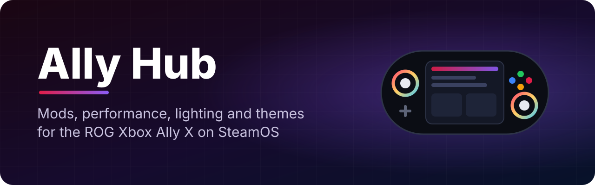

<p align="center">
  
</p>

<p align="center">
  
  
  
  
</p>

<p align="center"><b>One app to set up, customize and look after a ROG Xbox Ally X running SteamOS.</b><br>
Mods, plugins and apps in one tap, game performance boosts, joystick ring lighting, themes, health stats
and a phone remote. Works in Desktop Mode, and fully in Game Mode with just the controller.</p>

<p align="center"><sub>Built and maintained with <a href="https://claude.ai">Claude</a> (Anthropic's AI) under my direction.</sub></p>

<p align="center">
  <a href="#-install">Install</a> ·
  <a href="#-highlights">Highlights</a> ·
  <a href="#-whats-inside">What's inside</a> ·
  <a href="#-controller">Controller</a> ·
  <a href="#-faq">FAQ</a>
</p>

---

## ✨ Highlights

|   |   |
|---|---|
| 🎛️ **Quick Access panel** | Ally Hub in the ••• menu while you play: battery, temps, this game's switches, Game Boost, lighting and a save backup button |
| 🎮 **Made for Game Mode** | Five console-style tabs, every button, list and dropdown works with the controller, and pop-ups open inside the app instead of new windows. Simple by default, Advanced when you want every control |
| 🧩 **One store** | Essentials, mods, apps, launchers and the full Decky Plugin Store, each a section you reach with LT/RT: Decky Loader, Ally Center, Lossless Scaling and OptiScaler frame gen (Bazzite's builds), EmuDeck and more. Turn any plugin off without uninstalling it |
| 📦 **30 curated apps** | Heroic, Greenlight (Xbox Cloud), Moonlight, ProtonPlus, Discord, Spotify and more, each with install, update and remove |
| 🕹️ **PC launchers** | Battle.net, Epic, EA, Ubisoft, GOG and 10 more added straight to your Steam library with their own cover art, plus uninstall and a leftover cleaner |
| 🚀 **Performance** | Game Boost while you play, a one-tap system tune-up and FSR 4 for every game, ideas from CachyOS and Bazzite, all undoable |
| 🎚️ **Game settings** | Per-game switches instead of typing launch options (FSR 4, frame generation, Steam Deck mode and more), the right Proton per game, and help when a game won't start |
| 🕰️ **Save time machine** | A snapshot of each game's saves every time it starts, restorable from Game Mode, with undo |
| 🌙 **Sleep guardian** | Battery used per sleep, what woke the handheld and failed sleeps, with a fix for USB devices that keep waking it |
| 💽 **Storage saver** | See each game's real size and clear what Steam leaves behind: shader caches and files of removed games, unused Proton builds, old downloads |
| 🌈 **Ring lighting** | Smooth animated effects, a customizable RGB Spiral, battery and per-game colors, or hand the rings to HueSync |
| 🎨 **Themes** | 8 themes, custom accent colors, interface size, and tabs on the top or as icons down the sides |
| 🩺 **Home at a glance** | Temps, power draw and battery, a checkup that only shows what needs you (with the fix), history and drain per game |
| 🤖 **Background helper** | Dock mode, Update Guardian, battery history and scheduled game save backups |
| 📱 **Phone remote** | PIN-protected page to check battery and temps, change lighting and wake your PC |
| 🔄 **Self-updating** | Updates itself and rolls back on its own if a new version misbehaves |

## 🚀 Install

One time, about 3 minutes, needs an internet connection.

**1. Switch to Desktop Mode.** Press the **Steam** button, go to **Power**, then **Switch to Desktop**.

**2. Open Konsole.** Click the app launcher in the bottom-left corner, then **System → Konsole**.
No keyboard? Press **Steam + X** for the on-screen one.

**3. Paste this and press Enter.** Right-click → **Paste**, or **Ctrl + Shift + V**.

```bash
(git -C ~/AllyHub pull || git clone https://github.com/Ravenor907/AllyHub ~/AllyHub) && bash ~/AllyHub/scripts/install.sh
```

It's finished when it says **Done!**

**4. Open Ally Hub** from the desktop icon, the app launcher, or your Game Mode library (the installer adds it
there for you). The first time, a short setup walks you through the rest: a sudo password, Decky Loader and a few
favorites. Skip anything you like; Home keeps a reminder.

That's it. Ally Hub keeps itself up to date from here on.

<details>
<summary><b>Troubleshooting</b></summary>

- **"git: command not found"**: [download the ZIP](https://github.com/Ravenor907/AllyHub/archive/refs/heads/main.zip),
  extract it into your home folder, open Konsole in that folder and run `bash scripts/install.sh`.
- **It asks for a password**: the installer never does. Decky Loader, lighting and some tweaks need a sudo
  password later. No password yet? The checkup on Home has a **Set password** button.
- **Nothing happens after "Done!"**: log out and back in, or run `~/.local/bin/allyhub` in Konsole to see
  the error, then open a [bug report](../../issues/new?template=bug_report.yml).
- **Reinstall or repair**: run the same command again. Your settings are kept.

</details>

## 🧭 What's inside

| Tab | Sections |
|---|---|
| **Home** | Overview (battery, temps, checkup) · Battery & sleep · Storage (all cleanup) |
| **Store** | Essentials · Mods · Apps · Decky plugins · Installed · Launchers |
| **Games** | Game settings · Performance · Saves |
| **Customize** | Lighting · Theme |
| **Settings** | General (Simple / Advanced, background helper, updates, backups) · Connections (phone remote) · Activity log (Advanced) |

<details>
<summary><b>Performance</b></summary>

- **Game Boost** switches the CPU to its performance setting while a game runs (a little less on battery) and
  pauses Ally Hub's own backups and updates. TDP and GPU clocks stay with SteamOS.
- **System tune-up** applies the memory and kernel settings Bazzite, CachyOS and CryoUtilities ship: zram,
  memory tuning, huge pages, split-lock off and NTSync. It skips anything your kernel lacks. **Undo all** puts
  it back without a reboot.
- **Every game** turns on FSR 4 for Proton games (GE-Proton and Proton-CachyOS). On the Z2 Extreme it's a
  sharper image with a small frame cost, not a speed-up.

</details>

<details>
<summary><b>Launchers</b></summary>

Pick the PC stores you want and Ally Hub installs them with
[NonSteamLaunchers](https://github.com/moraroy/NonSteamLaunchers-On-Steam-Deck) in the background, then adds
them to your Steam library so they show up in Game Mode. Remove them the same way, and **Find leftovers**
cleans up what's left behind.

Each new tile gets a cover, banner and icon made on your handheld from the program's own icon, so nothing
shows up as a blank blue box. **Fix artwork** does the same for any non-Steam tile, and **Use my own picture**
sets one you like. Pictures you chose are never replaced.

</details>

<details>
<summary><b>Lighting</b></summary>

Customize → Lighting gives you a choice:

- **Ally Hub lighting**: twelve presets, Static, Breathe, Heartbeat, Color cycle, Wave, Strobe, Candle,
  Twinkle and **Spiral**, with speed, direction, color spread, rainbow or your own colors, and linked,
  mirrored or matching sticks. Save your own effects, give each game its own, or let the rings show your
  battery level.
- **HueSync**: prefer the [HueSync](https://github.com/honjow/HueSync) Decky plugin? One tap installs it and
  Ally Hub stays out of its way.

First time with Ally Hub lighting, run **Test lights**. It tries a few ways of talking to the lighting chip,
asks what color you see, and keeps the one that works on your system.

</details>

## 🎮 Controller

| Button | Action |
|---|---|
| D-pad | Move between controls |
| Left stick | Scroll the page |
| Right stick | Pointer (A or R3 clicks where it points, the D-pad takes back over) |
| **A** | Select |
| **B** | Back, or close a pop-up |
| D-pad left / right | Change a dropdown or slider |
| **LB / RB** | Switch tabs |
| **LT / RT** | Switch sections inside a tab |
| **X** | Search plugins |
| **Y** | Refresh |
| **☰ Menu** | Steam keyboard |

Using the side layout? Right moves into the page and Left goes back to the tabs.

## 🔄 Updates & error reports

- Ally Hub checks this repository every few hours and installs new versions in the background.
- **Want new features early?** Settings → General → Update channel → **Testing** follows the developer's test
  builds. Switch back to Stable any time.
- ⚠️ **Test builds can break, even badly enough that Ally Hub won't open.** On Testing you get an **Ally Hub
  Testing Rescue** entry in the app menu (Desktop Mode) that rolls back, goes back to Stable or uninstalls, without
  needing Ally Hub to open. If even that fails, uninstall and reinstall:
  `bash ~/.local/share/allyhub/uninstall.sh`, then the install command above.
- **Stable only gets builds the developer has tested on his own Ally.**
- New versions run on probation. If the app or its background helper fails to start 3 times, Ally Hub goes back
  to the previous version by itself.
- **Error reports are off unless you turn them on.** When on, crashes and failed installs become issues here,
  with IP and MAC addresses, usernames, PINs and keys removed first. Setup is on **Settings → General**.
- **Report a problem** sends your description right away with logs, the full task output and a
  system snapshot, scrubbed the same way.

## ❓ FAQ

**Which handhelds does it support?** It's built and tested on the **ROG Xbox Ally X** with SteamOS 3.8 or
newer. Most features should work on the ROG Ally and Ally X too, but they aren't tested. Bug reports welcome.

**Why isn't Handheld Daemon offered?** Its installer refuses to run on SteamOS. Ally Center covers the same
ground.

**What about TDP?** Use one tool at a time: Ally Center, SimpleDeckyTDP or the SteamOS slider.

**Can I use HueSync and Ally Hub lighting together?** No, they would fight over the rings. Pick one under
Customize → Lighting.

**Does it change system files?** Everything installs into your home folder. A few optional features (Decky,
lighting permission, charge limit, Game Boost, the tune-up) ask for your password and add a small setting
under `/etc`. The uninstaller removes Ally Hub's own settings.

**Is there a bottom bar?** It's off by default to give pages more room. Turn it on, or move the tabs to
the sides, under Customize → Theme.

**Does FSR 4 make games faster?** Not on the Z2 Extreme. It looks sharper than FSR 3 but costs a few frames.
Turn it on under Games → Performance if you prefer the image.

## 💬 Feedback

This is a personal project built for my own Ally X, shared in case it helps someone else.
**Bug reports and suggestions are welcome** through [Issues](../../issues/new/choose). Every one gets a
reply and I read them all, but I decide what goes into the app.

**About AI use:** Ally Hub is written with Claude, Anthropic's AI. I direct the work, test it on my own Ally X and
decide what ships.

## 🧹 Uninstall

```bash
bash ~/.local/share/allyhub/uninstall.sh
```

Removes Ally Hub, its background helper, its Quick Access panel and its system settings (lighting, charge limit and
performance).
Your mods, apps, launchers and `~/AllyHub-Backups` stay.

## 🙏 Credits

- [HueSync](https://github.com/honjow/HueSync) by honjow (BSD-3-Clause): Ally Hub's lighting chip code follows its method.
- [CachyOS](https://cachyos.org), [Bazzite](https://bazzite.gg) and [CryoUtilities](https://github.com/CryoByte33/steam-deck-utilities): the ideas behind Game Boost and the tune-up.
- [Lucide](https://lucide.dev) icons (ISC License).
- [NonSteamLaunchers](https://github.com/moraroy/NonSteamLaunchers-On-Steam-Deck) by moraroy: the Launchers page runs it.
- [Decky Loader](https://github.com/SteamDeckHomebrew/decky-loader) and every plugin and app author in the catalog.

---

<p align="center"><sub>Not affiliated with ASUS, Microsoft or Valve. Licensed under GPL-3.0.</sub></p>
